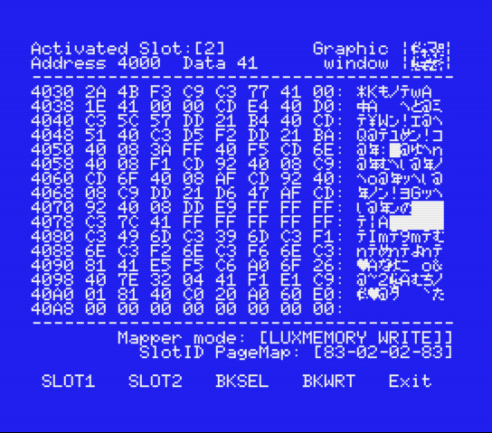

# MSXDOSAID
MSX DOS AID Monitor 

CST MSXDOS-AID2 Monitor v0.40
			ToughkidCST 2013. 12

v0.40 - 개선사항 

	1. 럭셔리박스 슬롯 테스터 모듈 수정, 
	2. MSX1, MSX-DOS1 의 환경에서 화면출력 비정상 버그 수정

알려진 버그  - 

	-  MSX-DOS1 일부 MSX환경에서 메모리 Edit기능 비정상 작동의 버그가 
	   확인되었습니다. 

---------------------------------------------------------------

MSXDOS-AID2 에 대하여 ...
 
모니터프로그램이 기본적으로 장착된 SPC-1000을 사용해 보신 분들이나,  
오래전 MSX에서 코딩해보신 분이라면, 
MSXDOS-AID2는 아마도  익숙하실 '모니터프로그램'의 MSX-DOS환경용 개발툴입니다. 

프로그램의 이름에서 감 잡으셨겠지만, 
예전 기본 베이직모드에서의 개발 필수품이라 할 수 있었던 당대 최고의 모니터인 
ASCII사의 MSX-AID를 MSX-DOS환경에서 좀더 확장된 용도로 사용하도록 만든 
모니터 프로그램입니다. 

MSX-DOS환경에서 쓸만한 모니터프로그램에 마땅한 것이 없어, 
MSXAID의 그 사용감을 그대로 계승하고,  
카트릿지슬롯과, 럭셔리박스의 메모리를 작업영역으로 사용하여, 
메가롬카트릿지나,  롬파일의 모니터링을 위해 만들었습니다. 

저는 주로 각종 파일들의 바이너리 모니터링이나, 
롬카트리지의 실시간 모니터링 및 
mglUx나 mglOCM에서의 롬파일 디버깅을 위해 사용하기도 합니다. 
결국 카트릿지슬롯의 실시간 메모리모니터링은 개발에 있어서 
사용자에 따라 매우 다양한 용도와, 효과를 얻어낼 수 있는 것이기에, 
MSXDOS-AID2의 효용성에 대한 설명은 이정도로 마치도록 합니다. 

----기능 

MSXDOS-AID2는 두가지파일을 포함합니다. 

		1. mdaMon.com - MSXDOS-AID2 Monitor 프로그램
			MSXDOS-AID2의 중심프로그램인 '모니터'입니다. 

		2. ldUx.com   - 럭셔리용 바이너리 로더 프로그램 
			럭셔리박스를 가지고 있다면, 모니터링을 위한 바이너리를 
			카트릿지 슬롯의 럭셔리박스에 그대로 로딩합니다. 

---- 사용방법

인터페이스 설명 - 

		1. 현재 모니터링되고  있는 카트릿지 슬롯입니다. 
		2. 현재 어드레스의 메모리 내용을 비트맵 표시합니다. 
		3. 카트릿지 슬롯을 제어하고 있는 매퍼 컨트롤 모드를 표시합니다. 
		4. 현재 모니터링되고 있는 페이지의 슬롯 정보를 표시합니다. 
	    
		SlotID PageMap : [83-02-02-83] 이라고 표시되어 있는 것은
	        메모리의 페이지 0, 1, 2, 3번이 현재 선택되어져 있는 슬롯번호를 
	    	보여줍니다.  
		
		0 0 0 0 0 0 0 0 
		7 6 5 4 3 2 1 0 - 7번비트는 슬롯이 확장되어있는지(1) 그렇지 않은지(0)
                                  3, 2번 비트는 확장 슬롯의 번호 	
				  1, 0번 비트는 메인 슬롯 번호입니다. 

		따라서 MDAMON이 모니터링하는 페이지는
			카트릿지슬롯이 위치한 페이지1, 2와 워크에어리어를 위한 페이지3, 
			도스어플이 위치한 페이지0번이 되겠습니다. 
				  
		
		5. MDAMON의 각 기능에 접근할 수 있는 펑션키 정보입니다. 

mdaMon.com의 모든 기능으로 접근하는데에는 기본적으로 펑션키를 사용합니다. 

모니터프로그램을 실행하면 아래쪽에 펑션키 대응 명령어가 표시되니 
대응하는 명령의 펑션키를 눌러 주시면 되겠습니다. 

처음 실행시  mdaMon(MSX-DOS AID Monitor)는 
카트리지 슬롯 1번을 선택해 4000번지 부터 메모리를 덤프해 보여줍니다. 

ADRES (f1): 표시할 메모리 어드레스를 셋팅하실 수 있습니다. 

EDIT  (f2): 메모리에 값을 입력합니다.   
	카트릿지슬롯에 일반 롬팩이 장착되어 있다면 의미가 없을 수 있지만, 
	메가롬팩이 장착되어 있다면, 
        카트리지가 가진 속성에 따라 억세스한 값에 의해 뱅크가 체인지 됩니다. 
        예를 들어 코나미SCC방식의 롬이 삽입되어 있다면, 
	5000~5FFF사이에 값을 입력과 동시에 뱅크체인지가 되는 것을 실시간 
        확인할 수 있습니다. 

	만일 카트릿지 슬롯에 럭셔리박스가 장착되어 있다면,
        'Mapper mode = [Luxury WRITE]'모드로 진입하여  
        메모리를 풀스크린 에디팅할 수 있도록 합니다. 

SLOT1 (f6) : 현재 모니터링하는 슬롯을 SLOT 1번으로 전환합니다. 

SLOT2 (f7) : 현재 모니터링하는 슬롯을 SLOT 2번으로 전환합니다.  
	     확장슬롯은 지원하지 않습니다.
 
BKSEL (f8) : 이 기능은 위 'EDIT'모드에서 설명드렸듯 메모리 억세스 방식을 
             "Bank select mode"로 선택해 메가롬의 뱅크체인지를 가능하게 합니다.  
		
BKWRT (f9) : 이 기능은 위 'EDIT'모드에서 설명드렸듯 럭셔리박스 장착히 
             풀스크린 에디트를 통해 메모리를 억세스 합니다. 

EXIT  (f10): DOS로 돌아갑니다. 

[SHIFT]+[CTRL]+[DEL] : 현재 MDAMON으로 셋팅한 환경을 그대로 유지한 상태로 웜부팅합니다.  

		  			
